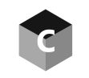

<div id="top"></div>

<!-- PROJECT LOGO -->
<br />
<div align="center">
  

  <h3 align="center">Crypto View</h3>

  <p align="center">
    A fully responsive Cryptocurrency Webapp
    <br />
    <a href="https://cryptoviewapp.netlify.app">View Demo</a>
  </p>
</div>


<!-- TABLE OF CONTENTS -->
<details>
  <summary>Table of Contents</summary>
  <ol>
    <li>
      <a href="#about-the-project">About The Project</a>
      <ul>
        <li><a href="#built-with">Built With</a></li>
      </ul>
    </li>
    <li>
      <a href="#getting-started">Getting Started</a>
      <ul>
        <li><a href="#prerequisites">Prerequisites</a></li>
        <li><a href="#installation">Installation</a></li>
      </ul>
    </li>
    <li><a href="#usage">Usage</a></li>
    <li><a href="#roadmap">Roadmap</a></li>
    <li><a href="#contributing">Contributing</a></li>
    <li><a href="#license">License</a></li>
    <li><a href="#contact">Contact</a></li>
    <li><a href="#acknowledgments">Acknowledgments</a></li>
  </ol>
</details>


<!-- ABOUT THE PROJECT -->
## About The Project

[![Product Name Screen Shot][product-screenshot]](https://cryptoviewapp.netlify.app)

This is a cryptocurrency webapp that was built to do 4 main things: 
<ol>
  <li>View the Top 100 Cryptocurrencies</li>
  <li>View the Top Cryptocurrencies Exchanges</li>
  <li>View curent Cryptocurrency news items</li>
  <li>Summarise the above on the homepage</li>
</ol>

<p align="right">(<a href="#top">back to top</a>)</p>

### Built With

* [React.js](https://reactjs.org/)
* [antd](https://ant.design/)
* [axios](https://www.axios.com/)
* [chart.js](https://www.chartjs.org/)
* [millify](https://www.npmjs.com/package/millify)
* [reduxjs/toolkit](https://redux-toolkit.js.org/)
* [RapidApi](https://rapidapi.com/)

<p align="right">(<a href="#top">back to top</a>)</p>

<!-- GETTING STARTED -->
## Getting Started

If you're familiar with git and npm then you will have no issues with cloning and installing this repo.

### Prerequisites

This is an example of how to list things you need to use the software and how to install them.
* npm
  ```sh
  npm install npm@latest -g
  ```

### Installation

1. Get a free API Key at [RapidApi](https://rapidapi.com/)
2. Clone the repo
   ```sh
   git clone https://github.com/kerry-davis/cryptoview.git
   ```
3. Install NPM packages
   ```sh
   npm install
   ```
4. Enter your API key into the process environment file created in the root dir. eg. `.env`
   ```js
   REACT_APP_RAPIDAPI_KEY='YOUR KEY NO QUOTES'
   REACT_APP_CRYPTO_RAPIDAPI_HOST=coinranking1.p.rapidapi.com
   REACT_APP_CRYPTONEWS_RAPIDAPI_HOST=bing-news-search1.p.rapidapi.com
   REACT_APP_BASEURL_NEWS=https://bing-news-search1.p.rapidapi.com
   REACT_APP_BASEURL=https://coinranking1.p.rapidapi.com
   ```

<p align="right">(<a href="#top">back to top</a>)</p>

<!-- USAGE EXAMPLES -->
## Usage

Either navigate the Homepage and click the 'Show More' link to be taken to the other pages, or click the items in the navigation side bar

<p align="right">(<a href="#top">back to top</a>)</p>


<!-- ROADMAP -->
## Roadmap

- [x] Create pages and deploy
- [ ] Change currency to the users preference eg. NZD

See the [open issues](https://github.com/kerry-davis/cryptoview/issues) for a full list of proposed features (and known issues).

<p align="right">(<a href="#top">back to top</a>)</p>


<!-- CONTRIBUTING -->
## Contributing

Contributions are what make the open source community such an amazing place to learn, inspire, and create. Any contributions you make are **greatly appreciated**.

If you have a suggestion that would make this better, please fork the repo and create a pull request. You can also simply open an issue with the tag "enhancement".
Don't forget to give the project a star! Thanks again!

1. Fork the Project
2. Create your Feature Branch (`git checkout -b feature/AmazingFeature`)
3. Commit your Changes (`git commit -m 'Add some AmazingFeature'`)
4. Push to the Branch (`git push origin feature/AmazingFeature`)
5. Open a Pull Request

<p align="right">(<a href="#top">back to top</a>)</p>


<!-- LICENSE -->
## License

Distributed under the MIT License. See `LICENSE.txt` for more information.

<p align="right">(<a href="#top">back to top</a>)</p>

<!-- CONTACT -->
## Contact

Kerry Davis: [@LinkedIn](https://www.linkedin.com/in/kerry-davis-673081222)

<p align="right">(<a href="#top">back to top</a>)</p>

<!-- ACKNOWLEDGMENTS -->
## Acknowledgments

I would like to thank the following for their hardwork which has made this project possible

* [JS Mastery](https://jsmastery.org/)
* [Best Readme Template](https://github.com/othneildrew/Best-README-Template)


<p align="right">(<a href="#top">back to top</a>)</p>


<!-- MARKDOWN LINKS & IMAGES -->
[product-screenshot]: src/images/screenshot.png
